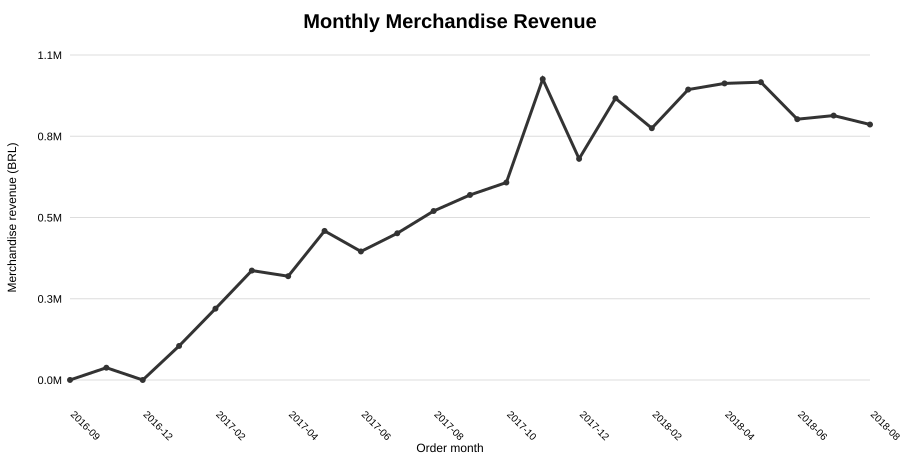
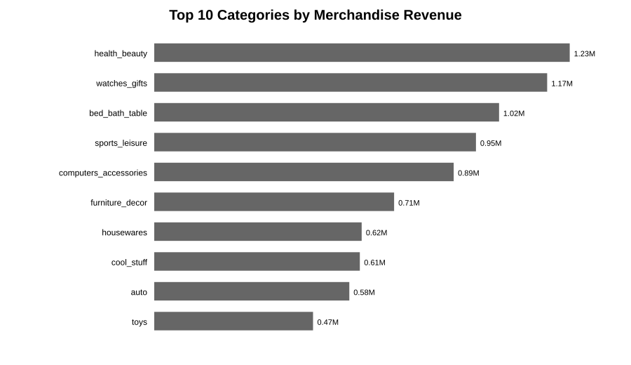
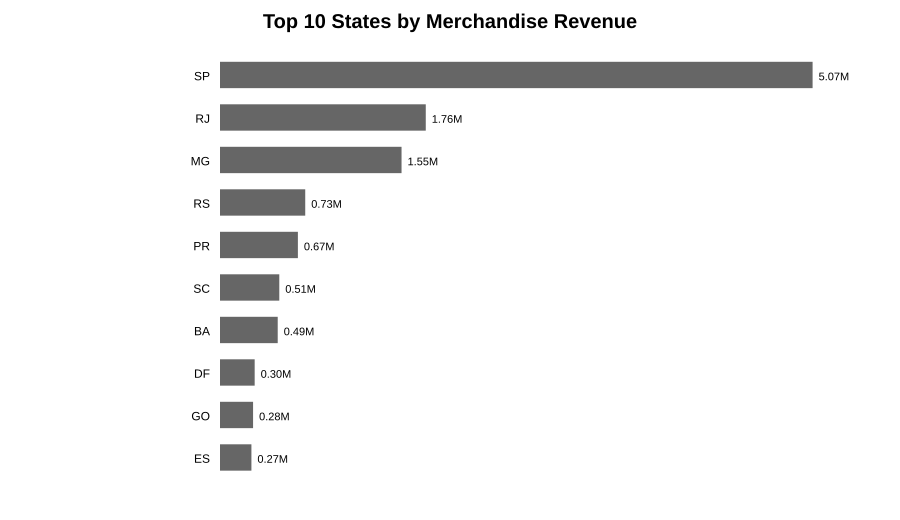
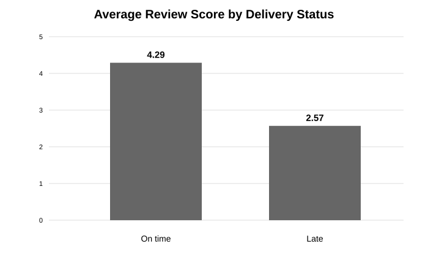

# E-commerce Revenue & Customer Analytics

An end-to-end **data analytics portfolio project** built on the **Brazilian E-Commerce Public Dataset by Olist**. The project focuses on revenue performance, customer behaviour, retention, product/category performance, payment mix, delivery performance, and management decision-making.

> **Dataset:** ~100,000 anonymized orders from Brazilian marketplaces, 2016–2018, released by Olist and distributed publicly on Kaggle. The relational files cover orders, customers, order items, products, sellers, payments, reviews, and geolocation.

## Business Objective

The analysis is designed to answer:

- How do revenue, orders, customers, and average order value change over time?
- Which product categories contribute the most merchandise revenue?
- Which Brazilian states contribute the most customers and sales?
- What percentage of customers purchase more than once?
- Which customers are most valuable based on recency, frequency, and monetary value?
- How does retention change across acquisition cohorts?
- Which payment methods are most used?
- How often are delivered orders late, and how does delivery performance relate to review scores?

## Important Olist Modelling Detail

Olist contains both `customer_id` and `customer_unique_id`. The project uses **`customer_unique_id` for customer-level analytics** because it represents the same customer across different orders, while `customer_id` is an order-level customer key.

## Skills Demonstrated

`PostgreSQL` · `SQL CTEs` · `Window Functions` · `Python` · `Pandas` · `Data Cleaning` · `EDA` · `Power BI` · `Excel` · `KPI Design` · `Cohort Analysis` · `RFM Segmentation` · `Business Storytelling`

## KPI Definitions

| KPI | Definition |
|---|---|
| Merchandise Revenue | Sum of `price` for delivered order items |
| Freight Value | Sum of `freight_value` for delivered order items |
| Orders | Distinct delivered orders |
| Customers | Distinct `customer_unique_id` values with delivered orders |
| Average Order Value | Merchandise revenue / delivered orders |
| MoM Revenue Growth | Month-over-month change in merchandise revenue |
| Repeat Purchase Rate | Share of unique customers with more than one delivered order |
| Retention Rate | Share of an acquisition cohort purchasing again in later months |
| Late Delivery Rate | Delivered orders arriving after estimated delivery date |
| RFM Segment | Customer segment based on recency, frequency, and monetary value |

## Dataset Files Used

- `olist_customers_dataset.csv`
- `olist_orders_dataset.csv`
- `olist_order_items_dataset.csv`
- `olist_order_payments_dataset.csv`
- `olist_order_reviews_dataset.csv`
- `olist_products_dataset.csv`
- `olist_sellers_dataset.csv`
- `product_category_name_translation.csv`

The large raw files are intentionally excluded from Git tracking. Download them from the official Olist dataset page on Kaggle and place them in `data/raw/`.

## Repository Structure

```text
Ecommerce-Revenue-Customer-Analytics/
├── data/
│   ├── raw/
│   └── processed/
├── docs/
│   ├── project_brief.md
│   └── data_dictionary.md
├── sql/
│   ├── 00_schema.sql
│   ├── 01_data_quality.sql
│   ├── 02_sales_kpis.sql
│   ├── 03_customer_analysis.sql
│   ├── 04_product_analysis.sql
│   ├── 05_cohort_retention.sql
│   └── 06_rfm_segmentation.sql
├── python/
│   ├── ecommerce_analysis.ipynb
│   └── build_analysis_tables.py
├── powerbi/
├── excel/
├── images/
├── business_report/
├── requirements.txt
├── .gitignore
├── LICENSE
└── README.md
```

## Reproduce the Analysis

1. Download the Olist CSV files and place them in `data/raw/`.
2. Install Python dependencies:

```bash
pip install -r requirements.txt
```

3. Build analysis-ready tables:

```bash
python python/build_analysis_tables.py
```

4. Load the CSV files into PostgreSQL using the table definitions in `sql/00_schema.sql`.
5. Run the SQL scripts in numerical order.
6. Connect Power BI to the processed tables or PostgreSQL outputs.

## Planned Dashboard Pages

1. **Executive Overview** — revenue, orders, customers, AOV, monthly growth
2. **Sales & Product Performance** — category, state, product, freight and payment analysis
3. **Customer Analytics** — new/returning customers and RFM segments
4. **Retention & Service Quality** — cohort retention, delivery delays, review scores


## Actual Results

| KPI | Result |
|---|---:|
| Delivered orders | **96,478** |
| Unique customers | **93,358** |
| Merchandise revenue | **R$13.22M** |
| Average order value | **R$137.04** |
| Repeat purchase rate | **3.00%** |
| Late delivery rate | **8.11%** |

### Selected Business Insights

- **Retention is weak:** only 3.00% of customers made more than one delivered purchase.
- **Delivery reliability matters:** average review score was 4.29 for on-time deliveries versus 2.57 for late deliveries.
- **Late deliveries are disproportionately associated with one-star reviews:** 46.21% of late deliveries received one star versus 6.59% of on-time deliveries.
- **Like-for-like growth:** Jan–Aug 2018 merchandise revenue was about 141.1% above Jan–Aug 2017, with orders about 139.9% higher.
- **Category concentration:** the top three categories generated about 25.9% of merchandise revenue.
- **Geographic concentration:** São Paulo generated about 38.3% of merchandise revenue.
- **Payment mix:** credit cards represented about 78.5% of recorded payment value.









Full findings and recommendations are documented in [`business_report/executive_summary.md`](business_report/executive_summary.md).

## Portfolio Integrity

This repository does **not fabricate KPIs or conclusions**. Quantitative findings are added only after the raw Olist files are loaded and the analysis pipeline is executed.

## Author

**Mohd Farhan**  
AI/ML & Data Analytics Portfolio
